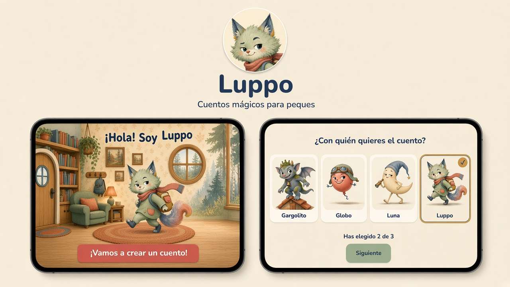

<div align="center">


# Luppo

**Cuentos que se inventan contigo.**

Cuentos interactivos generados con IA para niños de 3 a 6 años.

[](https://nextjs.org)
[](https://www.typescriptlang.org)
[](https://supabase.com)
[](https://vercel.com)
[](#estado--hoja-de-ruta)

[luppo-green.vercel.app](https://luppo-green.vercel.app) · de momento, solo el login

<br />



</div>

---

## Qué es

Luppo es una app (PWA) de cuentos interactivos y personalizados para niños de 3 a 6 años. Los cuentos se generan con IA, se narran con voz, los personajes se mueven y cada historia termina con una canción y un baile.

El anfitrión es **Luppo**, un lince verde salvia con bufanda terracota y mochila con forma de libro. Es neutro: ni chico ni chica.

## Cómo funciona

1. 🏡 **La casa de Luppo**: la pantalla de inicio.
2. 🎠 **Elige personajes**: un carrusel con 17 personajes; se eligen de 1 a 3 (Luppo también se puede elegir).
3. 🗺️ **Elige un lugar** donde pasará la historia.
4. 🤹 **Un momento…**: Luppo hace malabares mientras la IA (Claude) escribe el cuento.
5. 📖 **El cuento**: animado, narrado con voz, interactivo y educativo.
6. 💃 **Baile final** con canción y opción de guardar el cuento.

## Personajes

Luppo y 16 amigos: Dragoncito, Zorrito, Caracol, Nubecita, Robotito, Seta, Estrella, Manzana, Luna, Cactus, Flan, Globo, Zumbillo, Tiquitaque, Burbujo y Gargolito. Todos siguen el mismo estilo de libro de cuentos con colores apagados: salvia, ocre, terracota, azul tinta y crema.

El catálogo completo está en [docs/munecos.md](docs/munecos.md).

## Estado / hoja de ruta

Fase 1, en construcción:

- [x] Login por enlace mágico (Supabase)
- [x] Base de datos con RLS por familia
- [x] Home con la casa de Luppo
- [x] Carrusel de personajes
- [ ] Gestos de los personajes
- [ ] Elección de lugar y pantalla de espera
- [ ] Generación del cuento (Claude) y narración con voz
- [ ] Cuento animado
- [ ] Baile final con canción

## Stack

| Parte | Tecnología |
| --- | --- |
| Web | Next.js 16 (App Router, `--webpack`), TypeScript, Tailwind |
| App instalable | PWA con Serwist |
| Datos y login | Supabase (eu-west-1) |
| Despliegue | Vercel (funciones en Dublín) |
| Cuentos | Claude (Anthropic) |
| Narración | TTS (texto a voz) |
| Tests | Vitest |

## Para desarrollar

### Cómo arrancar

```bash
npm install
cp .env.example .env.local   # rellena los valores (nunca se suben a git)
npm run dev                  # http://localhost:3000
```

### Comandos

| Comando | Para qué sirve |
| --- | --- |
| `npm run dev` | Servidor de desarrollo (sin service worker) |
| `npm run build` | Compila para producción (genera el service worker) |
| `npm run lint` | Revisa el estilo del código |
| `npm run typecheck` | Revisa los tipos de TypeScript |
| `npm test` | Ejecuta los tests (Vitest) |
| `npm run check:secretos` | Busca claves en lo que vas a commitear |
| `npm run iconos` | Regenera los iconos de la PWA |

`npm install` activa un hook de pre-commit que ejecuta `check:secretos`.

### Probar la PWA

El service worker solo existe en producción: `npm run build && npm start`, y abrir en el navegador (instalable desde el menú).

### Configurar el login (Supabase)

El login es por enlace mágico (sin contraseña). En el panel de Supabase, **Authentication → URL Configuration**:

- **Site URL**: la URL de producción (o `http://localhost:3000` mientras pruebas).
- **Redirect URLs**: añade `http://localhost:3000/auth/callback` y `https://<tu-dominio-vercel>/auth/callback` (las de los previews también, si los usas).

Por defecto el enlace solo funciona si se abre **en el mismo navegador** donde se pidió. Para que funcione también desde otro navegador (por ejemplo, pedirlo en la PWA instalada y abrir el email en Safari), cambia en **Authentication → Emails → Magic Link** el enlace por:

```html
<a href="{{ .SiteURL }}/auth/callback?token_hash={{ .TokenHash }}&type=email">Entrar en Luppo</a>
```

Cuando las cuentas de la familia hayan entrado una vez, desactiva **Authentication → Sign In / Providers → Allow new users to sign up** para que nadie más pueda crear cuenta.

### Imágenes de los muñecos

Cada muñeco se busca en `public/munecos/<clave>.jpg` (por ejemplo `luppo.jpg`, `zorrito.jpg`). Si falta, la app enseña un bloque suave con su nombre.

### Reglas del repo (es público)

- Las claves van solo en `.env.local` y en las variables de Vercel. Nunca en el código, tests, commits ni PRs.
- Nada de datos reales de menores: en seeds y tests, perfiles inventados.

## Privacidad y seguridad

- **Sin datos reales de menores**: en seeds y tests solo se usan perfiles inventados.
- **Claves fuera del repo**: viven en `.env.local` y en las variables de Vercel, y un hook de pre-commit (`check:secretos`) revisa cada commit.
- **Datos separados por familia**: la base de datos usa RLS (Row Level Security), así que cada familia solo ve lo suyo.

## Build in public

Luppo lo construye **Ander**, estudiante de DAW, dirigiendo agentes de IA. Lo voy contando en abierto con #buildinpublic.
