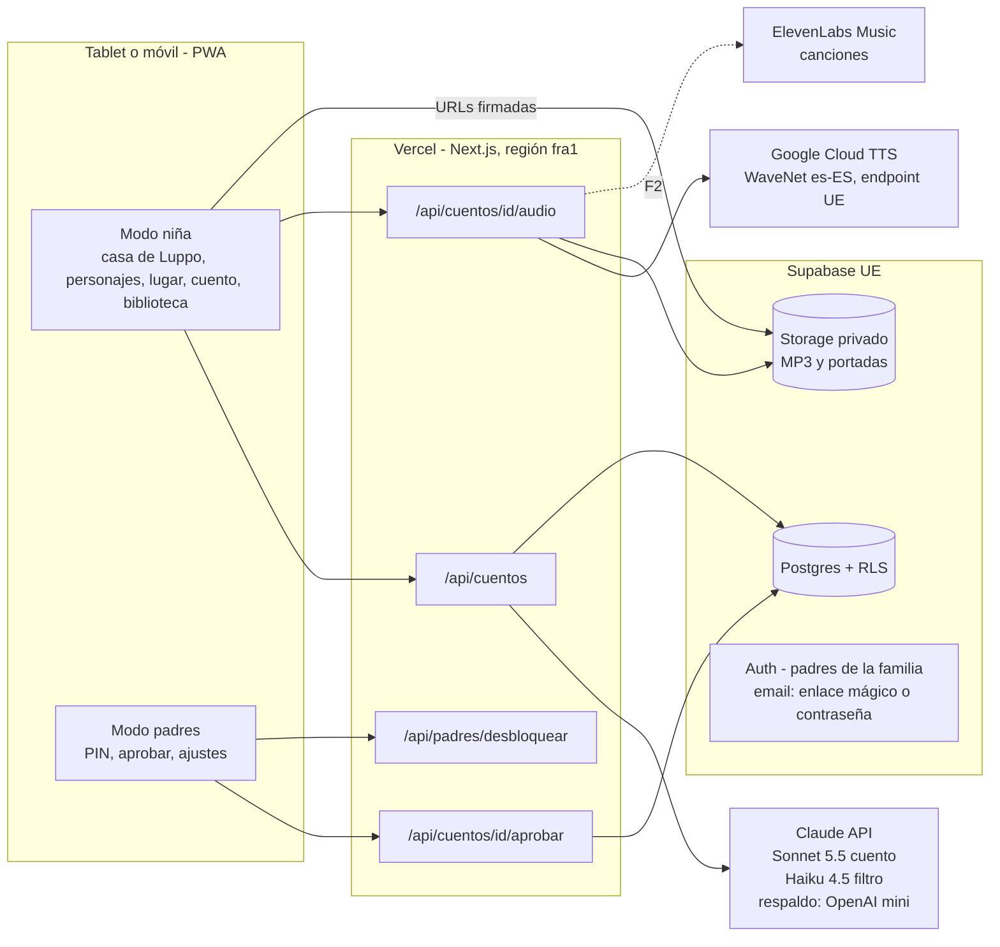

# 🏗️ Arquitectura v1 – Luppo (app de cuentos con muñecos)

> **Copia de la Arquitectura v1 (Notion) para Claude Code. Fuente de verdad: Notion. Datos personales sustituidos por marcadores.**
>
> Marcadores: `<padre>` y `<madre>` = los dos padres de la familia beta; `<nombre_niña>` = nombre real de la niña (no aparece en este documento). Los enlaces internos de Notion se han sustituido por el título de la página.
>
> Copia tomada de Notion el 2/10/2026 (última edición de la página: 2/10/2026, 13:09 hora de Madrid).

## Notas de implementación (desviaciones respecto al texto original)

- **Supabase**: el proyecto real está en **`eu-west-1` (Irlanda)**, no en `eu-central-1` (Frankfurt) como dice el documento.
- **Vercel**: las funciones van en la región **`dub1` (Dublín)**, no en `fra1`, para estar cerca de Supabase.
- Donde el documento diga `eu-central-1` / Frankfurt / `fra1`, aplicar estas notas.
- Cuando el encargo de F1 cite «criterios (arquitectura 8, 17, 18, 19)», se refiere a los **criterios de aceptación 8, 17, 18 y 19 de la sección 15** (RLS por familia, dos padres, perfiles por avatar y zona de padres con PIN).
- Las secciones sin número (Decisiones, Stack recomendado, Cuentas, Monetización) están en el mismo orden que en Notion, entre la 15 y la 16.

---

> 📌 Documento cerrado para la **Fase 1 (F1)**, con notas para F2 y F3. Primero lo revisa &lt;padre&gt; y después se entrega a Claude Code como encargo. Si algo no está aquí, en F1 **no se hace**. Las dudas abiertas están al final (sección 16) y hay que cerrarlas antes de empezar.

## 0. Mini-glosario (para leer el resto)
- **PWA**: web que se puede "instalar" en el móvil o tablet como si fuera una app, con su icono y a pantalla completa.
- **Next.js App Router**: la forma de organizar páginas y rutas en Next.js mediante carpetas dentro de `app/`.
- **Ruta de API / route handler**: archivo del servidor (`route.ts`) que recibe peticiones. Las claves secretas solo viven aquí.
- **Supabase**: base de datos (Postgres) + inicio de sesión (Auth) + almacén de archivos (Storage).
- **RLS** (Row Level Security): reglas dentro de la base de datos que hacen que cada usuario solo pueda ver sus propias filas.
- **Variable de entorno**: valor secreto o de configuración que se guarda en Vercel o en `.env.local` y nunca en el código.
- **JSON estructurado**: respuesta de Claude con una forma fija (campos concretos) que el código puede leer y comprobar.
- **Zod**: librería que comprueba que un JSON tiene la forma correcta. Si falla, se rechaza.
- **TTS**: texto a voz. **MP3**: el archivo de audio que resulta.
- **Parallax**: efecto de profundidad. El fondo se divide en capas (cielo, montañas, árboles, suelo) y, cuando la cámara se mueve, las capas lejanas se desplazan despacio y las cercanas más rápido, como al mirar por la ventanilla del coche.
- **Token**: trocito de texto (aprox. 3–4 letras) con el que Anthropic calcula el precio. **MTok** = un millón de tokens.
- **URL firmada**: enlace temporal (por ejemplo, de 1 hora) para descargar un archivo privado.

## 1. Visión general
La niña elige de 1 a 3 personajes y un lugar, el servidor pide a Claude un cuento educativo con ramas y con las acciones que hace cada personaje en cada escena, se comprueba que es seguro, se convierte a voz con Google y se guarda todo en Supabase. Después se reproduce desde ahí tantas veces como quiera sin volver a pagar.


## 2. Decisiones cerradas
- **Stack**: Next.js (App Router) + TypeScript + Tailwind, en Vercel. Supabase en la región UE (Frankfurt, `eu-central-1`) y funciones de Vercel en `fra1` (Frankfurt), para que estén cerca. Es un **proyecto de Supabase nuevo**, separado de Perfilio y Kore.
- **PWA**: archivo `app/manifest.ts` + *service worker* (programa que corre en segundo plano y guarda en caché) con **Serwist**. En F1 solo se guardan en caché la app y las imágenes fijas; los audios se cachean al reproducirlos.
- **Cuentas y familia**: Supabase Auth con **email**, entrando con **enlace mágico** (un enlace que llega al correo y abre la sesión sin contraseña) **o con contraseña**, a elección de cada padre. Todo cuelga de una **familia**: varios padres pueden entrar en la misma (&lt;padre&gt; y &lt;madre&gt;), cada uno con su email. Cada familia tiene **varios perfiles de niño**, que no tienen cuenta ni contraseña: se eligen tocando su avatar. Cada perfil tiene sus propios cuentos guardados. El dispositivo queda con la sesión de un padre abierta y arranca siempre en modo niño.
- **Modelo del cuento**: Claude **Sonnet 5.5**, con una cuenta nueva de Anthropic solo para Luppo. **Filtro de seguridad**: Claude **Haiku 4.5**. Los nombres exactos de los modelos van en variables de entorno. **Respaldo**: OpenAI (GPT-4o mini o GPT-4.1 mini) para emergencias y tareas sencillas, a través de una **capa de proveedor intercambiable** (ver «Stack recomendado»).
- **Animación**: **Rive** para los personajes, con **Motion** de respaldo (ver «Stack recomendado»). Claude devuelve en cada escena acciones de una **lista cerrada** (`quieto`, `caminar`, `esconderse`, `agacharse`, `saltar`, `bailar`, `saludar`, más las acciones de cada escenario de actividad, como fútbol o patinete; ver 10.5) y la app las convierte en animaciones.
- **Escenarios de dos tipos**: **lugar** (bosque, playa, parque…) y **actividad** (jugar al fútbol, ir en patinete…), que se pueden **combinar** (por ejemplo patinete en el parque). Claude recibe la **lista cerrada de escenarios, acciones y accesorios** y no puede salirse de ella (ver 10.5).
- **Voz y música**: en el MVP narra **Google Cloud TTS WaveNet es-ES** (la voz barata: 4 USD por millón de caracteres y 4 millones gratis al mes). La calidad de voz, animación o canciones se sube más adelante si hace falta (por ejemplo a Chirp 3 HD). Google narra el cuento (llamado desde el endpoint de la UE; una voz de narrador y una segunda voz para el muñeco que pregunta). **ElevenLabs** hace las **canciones** (Music), con una cuota mensual pequeña que &lt;padre&gt; acepta. Antes de fijar el catálogo de canciones, se prueba con la niña qué canciones le gustan.
- **Imágenes en F1**: **no se generan imágenes con IA mientras se usa la app**, porque es lento, caro y rompe el estilo Luppo. Se usan las imágenes ya hechas de los muñecos más un **catálogo fijo** de lugares, iconos y **personajes secundarios** dentro de `public/`. Claude solo elige "claves" de ese catálogo (por ejemplo `bosque`, `playa` o `taquillero`).
- **Nada estático**: cada lugar es un **fondo por capas con parallax** (ver glosario) y elementos animados en bucle (nubes, hojas, luces, agua). Cuando un personaje camina, la **cámara se desplaza** con él. Los personajes reaccionan a las acciones de la lista cerrada (ver 10.3).
- **Personajes secundarios fortuitos**: además de los protagonistas pueden aparecer personajes de paso (un taquillero, una bruja con escoba en el tren de la bruja…). Salen de un catálogo de unos 20–25 ya dibujados; Claude los elige por escena con el campo `secundarios` (ver 10.4).
- **Estructura del cuento**: forma de **"diamante"**: 3 o 4 interacciones (elegir o aprender) con 2 o 3 opciones cada una; cada opción tiene una escena corta y después la historia vuelve al tronco común. Cada cuento enseña algo (colores, números, emociones, naturaleza o hábitos) adaptado a 3–6 años. Se genera en dos pasos (primera escena primero y el resto en segundo plano; ver 6.1) y se guarda entero.
- **Aprobación de padres**: los **primeros 5 cuentos** necesitan que un padre de la familia (&lt;padre&gt; o &lt;madre&gt;) los apruebe antes de que la niña los vea sola. Del sexto en adelante llegan directos; los padres pueden volver a activar la aprobación en Ajustes.
- **Privacidad**: sin anuncios, sin analítica de terceros, sin micrófono en F1. El único dato personal de la niña es su **nombre real** (más el rango de edad), y solo con el **consentimiento explícito de los padres**. Se guarda solo en el Supabase de la familia y solo lo pueden ver los padres (RLS). En la zona de padres hay un botón para **borrar el nombre o el perfil** entero. A Claude y a Google solo les llega el texto del cuento (que puede incluir el nombre de la niña) y las fichas de los muñecos; nunca apellidos, dirección ni colegio.

## 3. Componentes

### 3.1 Pantallas (lo que se ve)
1. **Inicio de sesión (solo padres, una vez por dispositivo)**: email y, a elegir, «Enviarme un enlace» (enlace mágico) o contraseña. Un padre nuevo (por ejemplo &lt;madre&gt;) se registra igual y se une a la familia con la invitación que le envía otro padre. Después la sesión queda abierta.
2. **Bienvenida**: un botón gigante ▶. Sirve para "desbloquear" el audio en iOS (ver sección 11).
3. **¿Quién escucha? (elegir perfil)**: avatares grandes de los niños de la familia; se toca el suyo y listo, **sin contraseña**. Si la familia solo tiene un perfil, se salta. Desde el Home se puede volver a esta pantalla.
4. **Home (casa de Luppo)**: nada más entrar, Luppo recibe a la niña en su casa y la saluda. Botones grandes: «¡Cuento!» y «Biblioteca». El candado de padres va en una esquina.
5. **Selector de personajes**: un **carrusel** (fila que se desliza en horizontal con el dedo) con unos 4 personajes a la vista y flechas grandes a los lados por si aún no domina deslizar. Se eligen **de 1 a 3**; cada personaje dice su nombre al tocarlo. Al final del carrusel hay un botón **«+»** que lleva a «Crear personaje».
6. **Crear personaje (marcador)**: en F1 solo muestra a Luppo diciendo "¡Muy pronto podrás crear tu propio personaje!" y un botón para volver. Cómo funcionará está por decidir.
7. **Elegir escenario**: al confirmar los personajes aparecen solas 3 opciones con un dibujo grande. Pueden ser un **lugar** (por ejemplo bosque, playa o granja), una **actividad** (jugar al fútbol, ir en patinete) o una combinación de los dos (patinete en el parque). Salen del catálogo fijo, elegidas con reglas sencillas según los lugares favoritos de cada personaje, así que aparecen al instante y sin llamar a Claude.
8. **Preparando**: Luppo hace malabares o piruetas en bucle durante los segundos que tarda en llegar la primera escena (ver 6.1). Durante los 5 primeros cuentos el mensaje es "¡Papá o mamá tienen que mirarlo primero!" y se vuelve al Home.
9. **Reproductor**: fondo del lugar **por capas con parallax** y elementos en bucle (nubes, hojas, luces) + cámara que sigue al personaje cuando camina + personajes **animados** + **secundarios** de paso cuando el cuento los trae + voz. Nada está quieto. En cada escena los personajes hacen las acciones que indica el cuento (caminar, esconderse, agacharse, saltar, bailar, saludar…); no son imágenes quietas. Cada cierto tiempo (3 o 4 veces por cuento) llega una **interacción**: aparecen 2 o 3 iconos enormes para **elegir** qué pasa o para **aprender** algo ("¿Qué hoja es verde?", "Toca 3 estrellas"). Cada icono dice su nombre al tocarlo y con un segundo toque se elige. Si no hay toque en 8 s, se repite la pregunta; si tras otros 8 s sigue sin tocar, el personaje elige o responde con cariño.
10. **Final con baile**: los personajes bailan con una canción pegadiza (canción base pregenerada). Después, despedida tranquila y dos botones: **«Guardar»** (lleva el cuento a la biblioteca) y **«Volver a casa»**.
11. **Biblioteca**: portadas grandes de los cuentos guardados **del perfil elegido** (cada niño ve solo los suyos). Al tocar una se reproduce el cuento entero, sin coste.
12. **Puerta de padres**: mantener pulsado el candado 3 s, después una suma sencilla y después el **PIN** de 4 dígitos. La suma solo frena a la niña; la protección real es el PIN.
13. **Zona de padres**: cuentos pendientes (leer el texto, escuchar, aprobar o rechazar, con el contador "quedan X de 5"), ajustes (aprobación obligatoria sí/no, minutos máximos por sesión, cuentos máximos al día, cambiar el PIN), borrar cuentos, y **Familia**: invitar a otro padre por email (&lt;padre&gt; invita a &lt;madre&gt;), ver quién tiene acceso, y crear, editar o borrar perfiles de niño (nombre, avatar y rango de edad) o borrar solo su nombre. Cualquier padre de la familia entra con el mismo PIN familiar.

### 3.2 Piezas de código
- **Capa de IA** (`lib/ia/`): una interfaz común (`generarCuento`, `revisarCuento`) con una implementación principal para Anthropic y otra de respaldo para OpenAI. La variable `IA_PROVEEDOR` elige cuál se usa.
- **Cliente de Claude** (`lib/claude/`): construye el prompt, pide el JSON estructurado y lo valida con Zod.
- **Animación** (`components/MunecoAnimado.tsx` + `lib/animacion/acciones.ts`): traduce cada acción de la lista cerrada a un estado de Rive o, si el personaje aún no tiene archivo Rive, a una animación de Motion.
- **Filtro de seguridad** (`lib/claude/filtro.ts`): reglas locales más una revisión con Haiku.
- **Cliente TTS** (`lib/tts/google.ts`): convierte el texto de cada escena en MP3.
- **Reproductor de audio** (`lib/audio/`): un único elemento de audio que se reutiliza, desbloqueado al primer toque.
- **Catálogo** (`lib/catalogo/`): lista de claves de lugares (con sus capas y elementos en bucle), iconos y secundarios (con sus animaciones), con su imagen y su palabra hablada.
- **Escenario** (`components/FondoParallax.tsx` + `lib/animacion/camara.ts`): pinta las capas del lugar, anima los elementos en bucle y mueve la cámara cuando un personaje camina.
- **Supabase** (`lib/supabase/`): un cliente para el servidor (usa la sesión del padre que ha entrado, así que RLS se aplica) y otro para el navegador.

## 4. Modelo de datos (tablas)
Todas las tablas tienen `id uuid`, `created_at` y **RLS activado**. Los datos no son de un usuario sino de una **familia**: casi todas las tablas llevan `familia_id`, y un usuario de Supabase (un padre) ve una fila solo si es miembro de esa familia.

| Tabla | Campos principales | Para qué |
|---|---|---|
| **familias** | nombre ("Familia de &lt;padre&gt; y &lt;madre&gt;"), creada_por (usuario de Supabase), plan (`beta`, `prueba`, `luppo`, `luppo_plus` o `caducado`; en F1 todas las familias van en `beta`, sin cobro), plan_hasta (fecha: fin de la prueba o del periodo pagado; null en beta), stripe_customer_id (null; solo cuando se cobre) | Agrupa a padres, perfiles y cuentos. En F1 solo existe una, pero el modelo admite más |
| **uso_mensual** | familia_id, mes (fecha del día 1), cuentos_generados (int), coste_usd (numérico), unique (familia_id, mes) | Contador de cuentos por familia y mes. Se suma 1 en cada cuento nuevo (volver a escuchar no cuenta). En F1 solo se mide; en la fase de pago sirve para aplicar el tope diario y vigilar el coste por familia |
| **miembros_familia** | familia_id, user_id (usuario de Supabase Auth), rol (`padre`), unique (familia_id, user_id) | Qué padres pueden entrar en cada familia (&lt;padre&gt; y &lt;madre&gt;). Es la base de todas las reglas RLS |
| **invitaciones_familia** | familia_id, email, token_hash, invitado_por, caduca_at (7 días), aceptada_at | Para que un padre invite a otro. El invitado entra con su email y la invitación se acepta con la función `aceptar_invitacion(token)` (función de la base de datos que comprueba el token y lo añade a `miembros_familia`), sin usar la llave maestra |
| **ajustes_familia** | familia_id (único), pin_hash, aprobaciones_pendientes (int, 5: cuentos que aún deben aprobar los padres), aprobacion_obligatoria (bool, false: exigir aprobación siempre), minutos_max_sesion (int, 15), cuentos_max_dia (int, 3) | Configuración del modo padres. Un cuento necesita aprobación si quedan aprobaciones pendientes o si los padres la activan siempre. Un solo PIN por familia, que sirve a cualquier padre. El PIN se guarda cifrado (hash), nunca en claro |
| **perfiles_hijo** (mínimo) | familia_id, avatar_clave (dibujo del catálogo, no una foto), nombre (admite el nombre real; nunca apellidos), consentimiento_padres_at (fecha del consentimiento explícito; sin él no se guarda el nombre), rango_edad (texto, "3-4"), temas_favoritos (text array, opcional) | Un perfil por niño, sin cuenta ni contraseña: se elige tocando su avatar. Sirve para adaptar el cuento a la edad y nombrar al niño. Solo lo ven los padres de la familia (RLS). Desde la zona de padres se puede borrar el nombre o el perfil. Sin apellidos, fecha de nacimiento, foto, dirección, colegio ni ubicación |
| **munecos** | familia_id (null = muñeco del sistema), clave ("zumbillo"), nombre, especie, personalidad, forma_de_hablar, voz_tts, imagen_path, rive_archivo (ruta del `.riv`; null = se anima con Motion), lugares_favoritos (text array), capas (jsonb, F2), es_sistema (bool), activo (bool) | Los 16 muñecos de la página Muñecos se cargan con un archivo de semilla (`seed.sql`). En F3 se añaden los creados por la niña |
| **cuentos** | familia_id, perfil_id (de qué niño es), creado_por (padre con cuya sesión se creó), aprobado_por, titulo, protagonistas (uuid array, de 1 a 3), lugar_clave, tema_educativo, estado (generando, revisando, pendiente_aprobacion, listo, rechazado, error), json_original (jsonb), modelo, version_prompt, portada_path, tokens_entrada, tokens_salida, caracteres_tts, coste_estimado_usd, aprobado_at, guardado (bool: si está en la biblioteca de ese perfil) | Cabecera de cada cuento y control de costes |
| **escenas** | cuento_id, clave ("s1", "d1", "r1a"…), orden, tipo (narracion, decision, rama, final), interaccion (elegir o aprender, solo en las de tipo decision), habla (narrador o clave de muñeco), texto, acciones (jsonb: lista de personaje + acción de la lista cerrada), secundarios (jsonb: lista de clave de secundario + acción), fondo_clave, siguiente_clave, opcion_por_defecto, audio_path, audio_ms | Cada trozo del cuento con su audio |
| **decisiones** | escena_id, orden, etiqueta ("Bosque"), icono_clave, destino_clave, es_correcta (bool, solo en las de aprender), audio_path (la palabra hablada) | Las opciones de cada escena de tipo decisión |
| **canciones** | muneco_id, cuento_id (null si es la base), tipo (instrumental_base, estribillo_cantado, estrofa_hablada, cancion_cuento), letra, audio_path, proveedor, duracion_s, coste_usd | Música de cada muñeco y de cada cuento. En F1 solo se usan las canciones base pregeneradas (tipo `instrumental_base` con gancho cantado); las de cada cuento llegan en F2 |
| **secundarios** | clave ("taquillero"), nombre, descripcion, lugares (text array: dónde encaja), imagen_path, rive_archivo (null = Motion), acciones_disponibles (text array, 2–3: p. ej. `quieto`, `saludar`, `volar`), es_comodin (bool), activo (bool) | Catálogo de 20–25 personajes de paso ya dibujados en estilo Luppo (taquillero, bruja, guardia, panadero, pirata, médico, granjero…). Ninguno lleva bufanda, ni orejas ni cola de Luppo. Se carga con `seed.sql`. Uno es el **comodín** genérico |
| **secundarios_pedidos** | familia_id, cuento_id, clave_pedida ("socorrista"), descripcion (lo que Claude quería), veces (int), primer_pedido_at, estado (pendiente, dibujado, descartado) | Lista de deseos: cuando Claude pide un secundario que no existe, se usa el comodín y se apunta aquí para dibujarlo después y añadirlo al catálogo |

**Reglas RLS (en palabras sencillas):**
- Una función `es_miembro(familia_id)` devuelve verdadero si `auth.uid()` (el usuario que ha entrado) está en `miembros_familia` para esa familia. Todas las reglas la usan, así que **el RLS va por familia**: &lt;padre&gt; y &lt;madre&gt; ven lo mismo y nadie de fuera ve nada.
- `familias`, `ajustes_familia`, `perfiles_hijo`, `cuentos`, `invitaciones_familia`: leer y escribir solo si `es_miembro(familia_id)`.
- `miembros_familia`: cada padre ve los miembros de sus familias. Solo se añade a alguien con `aceptar_invitacion(token)` o al crear la familia (el creador entra como primer miembro).
- `munecos`: leer si `es_sistema = true` o si `es_miembro(familia_id)`; escribir solo los de la familia.
- `escenas` y `decisiones`: permitido solo si el cuento padre es de tu familia (la regla comprueba la tabla `cuentos`).
- **Perfiles**: el RLS protege a la familia entera; la separación entre niños la hace la app filtrando por `perfil_id` (la biblioteca de cada niño solo muestra sus cuentos).
- **Storage**: bucket privado `cuentos` con rutas `familia_id/perfil_id/cuento_id/escena.mp3`. La regla permite el acceso solo si la primera carpeta es una familia de la que eres miembro. El navegador recibe URLs firmadas de 1 hora.
- **Zona de padres**: además de la sesión, exige la cookie de padres (PIN familiar); sin ella no se puede aprobar, cambiar ajustes, invitar ni tocar perfiles.
- `secundarios`: lectura para cualquier sesión (es catálogo del sistema); solo se escribe con migraciones. `secundarios_pedidos`: solo si `es_miembro(familia_id)`.
- Las imágenes fijas (muñecos, capas de lugares, iconos, secundarios) van en `public/`, no en Storage.
- La `SUPABASE_SERVICE_ROLE_KEY` (llave maestra que se salta RLS) **no se usa en F1** dentro de la app. Solo para migraciones o scripts.

## 5. Rutas de API (servidor)
Todas comprueban que hay sesión de un padre miembro de la familia y devuelven errores claros en español.

| Método y ruta | Qué hace | Notas |
|---|---|---|
| POST `/api/cuentos` | Recibe perfil, de 1 a 3 personajes y el lugar. Pide a la IA la primera escena, la valida, la filtra y la guarda, y devuelve el id en cuanto está lista. El resto del cuento se sigue generando en segundo plano (ver 6.1) | Respeta `cuentos_max_dia`. Como máximo 1 reintento si falla la validación o el filtro. El segundo plano usa `after()` de Next.js (ejecuta trabajo después de enviar la respuesta) |
| POST `/api/cuentos/[id]/audio` | Genera el MP3 de cada escena y de cada opción que aún no lo tenga y lo sube a Storage | **Idempotente** (si se llama dos veces no repite trabajo ni coste). Lotes de 5 llamadas en paralelo |
| GET `/api/cuentos/[id]` | Devuelve el cuento listo con URLs firmadas | En modo niña solo devuelve cuentos en estado `listo` |
| GET `/api/biblioteca` | Lista los cuentos guardados del perfil elegido (título, portada, fecha) | Ordenados del más nuevo al más viejo |
| POST `/api/cuentos/[id]/guardar` | Marca el cuento como guardado (o lo quita) para que salga en la biblioteca | Lo usa el botón «Guardar» del final |
| POST `/api/padres/desbloquear` | Comprueba el PIN y crea una cookie de padres de 10 minutos | Cookie *httpOnly* (el JavaScript de la página no puede leerla). Bloqueo de 5 minutos tras 5 fallos |
| POST `/api/cuentos/[id]/aprobar` y `/rechazar` | Cambia el estado a `listo` o a `rechazado` | Exige la cookie de padres |
| PATCH `/api/padres/ajustes` | Cambia ajustes y PIN | Exige la cookie de padres |
| GET `/api/perfiles` | Lista los perfiles de niño de la familia (nombre y avatar) para la pantalla «¿Quién escucha?» | Solo sesión; no pide PIN |
| POST, PATCH y DELETE `/api/padres/perfiles` | Crea, edita o borra perfiles de niño | Exige la cookie de padres |
| POST `/api/padres/invitar` · POST `/api/familia/aceptar` | Un padre invita a otro por email; el invitado, ya con sesión, acepta con el token | Invitar exige la cookie de padres. Aceptar llama a `aceptar_invitacion(token)` |
| F2: POST `/api/munecos/[id]/musica-base` · POST `/api/cuentos/[id]/cancion` | Música base del muñeco (se hace una vez) y canción del cuento | Fuera de F1 |

En Vercel, cada ruta que llama a Claude o a TTS lleva `export const maxDuration` (tiempo máximo que puede tardar) y `export const runtime = "nodejs"`. El límite exacto depende del plan de Vercel y hay que comprobarlo; por eso texto y audio van en rutas separadas.

## 6. Flujo de creación de un cuento (paso a paso)
1. La niña elige de 1 a 3 personajes y un lugar. El navegador hace POST a `/api/cuentos` con el perfil, los personajes y el lugar.
2. El servidor comprueba la sesión y el límite diario, crea la fila `cuentos` en estado `generando` y elige el **tema educativo** (colores, números, emociones, naturaleza o hábitos), rotando para no repetir el de los últimos cuentos.
3. El servidor arma el prompt: reglas de seguridad (fijas) + fichas de los personajes + nombre y rango de edad de la niña + escenario (lugar y, si la hay, actividad) + tema educativo + lista cerrada de escenarios, acciones y accesorios + lista de claves del catálogo + esquema JSON.
4. Llama a **Claude Sonnet 5.5** (a través de la capa de IA y en dos pasos, ver 6.1) pidiendo **salida estructurada** (Claude responde obligatoriamente con el esquema; ver la [documentación de Structured outputs](https://platform.claude.com/docs/en/build-with-claude/structured-outputs)).
5. **Validación con Zod + comprobaciones de lógica**: todas las claves de destino existen, no hay bucles, hay 3 o 4 interacciones y 1 final, los lugares, actividades, iconos y accesorios están en el catálogo, las **acciones son solo de la lista cerrada** (y las de actividad, solo si el cuento tiene esa actividad) y de personajes del cuento, y se respetan los límites de longitud.
6. Estado `revisando`. **Filtro**:
   - (a) Lista local de palabras prohibidas.
   - (b) **Haiku 4.5** lee el cuento y responde `apto` o no, con motivos.
   - Si no pasa, se repite desde el paso 4 una sola vez. Si vuelve a fallar: estado `error` y mensaje en la zona de padres.
7. Se guardan las escenas y las decisiones en la base de datos.
8. El navegador llama a `/api/cuentos/[id]/audio`. Por cada escena y cada opción: TTS, MP3, subida a Storage y se guarda `audio_path`.
9. Si quedan aprobaciones pendientes (los 5 primeros cuentos) o los padres activaron la aprobación: estado `pendiente_aprobacion` (la niña ve "papá o mamá lo miran primero"). Al aprobarlo, el contador baja uno. Si no: estado `listo` y empieza el reproductor.
10. Se calcula y guarda el coste estimado (tokens y caracteres).
11. Para volver a escucharlo **no se llama a ninguna API externa**: solo Supabase.
12. **Reproducción**: la app lee las `acciones` de cada escena y se las pasa a `MunecoAnimado`, que las convierte en animación (Rive o Motion).
13. **Final y guardar**: baile con la canción base del personaje principal (o la de Luppo si hay varios). El botón «Guardar» llama a `/api/cuentos/[id]/guardar` y el cuento aparece en la biblioteca.

### 6.1 Ocultar la espera (latencia)
*Latencia* = el tiempo que pasa desde que la niña elige el lugar hasta que empieza a sonar el cuento. Escribir el cuento entero tarda bastantes segundos, así que se reparte en dos pasos:
- **(a) Primera escena primero**: una llamada corta pide el plan del cuento (título y resumen de cada escena) y el texto completo de la escena 1. Llega en pocos segundos; se valida, se filtra, se pasa a voz y empieza a sonar mientras Luppo termina su pirueta.
- **(b) El resto en segundo plano, con streaming**: una segunda llamada escribe las demás escenas siguiendo el plan. Con *streaming* (Claude va enviando la respuesta a trozos en vez de esperar al final), cada escena se valida, se filtra y se convierte a voz en cuanto llega, siempre antes de que la niña la necesite. Si el streaming de la salida estructurada diera problemas, basta con el paso (a) y generar el resto de golpe: la primera escena dura lo suficiente para taparlo.
- Si una escena no pasa el filtro, se pide otra vez una sola vez. Si vuelve a fallar, Luppo cierra con un final corto ya grabado y el error aparece en la zona de padres.
- **Durante los 5 primeros cuentos** no hace falta correr: se genera todo, queda en `pendiente_aprobacion` y &lt;padre&gt; lo revisa entero.

## 7. Esquema JSON del cuento (ejemplo)
```json
{
  "version": 1,
  "titulo": "Zumbillo y la nube que quería bailar",
  "protagonistas": ["zumbillo", "nubecita"],
  "lugar": "prado",
  "tema_educativo": { "tema": "colores", "objetivo": "reconocer el verde y el rojo" },
  "escenas": [
    { "clave": "s1", "tipo": "narracion", "habla": "narrador", "fondo": "prado",
      "texto": "Una mañana de sol, Zumbillo encontró a Nubecita muy quietecita.",
      "acciones": [{ "personaje": "zumbillo", "accion": "caminar" }, { "personaje": "nubecita", "accion": "quieto" }],
      "siguiente": "d1" },
    { "clave": "d1", "tipo": "decision", "habla": "zumbillo", "fondo": "prado",
      "interaccion": "elegir",
      "texto": "¿Vamos a jugar al bosque o a la playa?",
      "opciones": [
        { "etiqueta": "Bosque", "icono": "bosque", "destino": "r1a" },
        { "etiqueta": "Playa",  "icono": "playa",  "destino": "r1b" }
      ],
      "por_defecto": "r1a" },
    { "clave": "r1a", "tipo": "rama", "habla": "narrador", "fondo": "bosque",
      "texto": "En el bosque, las hojas verdes hacían cosquillas. ¡Ji, ji! Un granjero las saludó desde el camino.",
      "secundarios": [{ "clave": "granjero", "accion": "saludar" }],
      "acciones": [{ "personaje": "nubecita", "accion": "esconderse" }], "siguiente": "s2" },
    { "clave": "r1b", "tipo": "rama", "habla": "narrador", "fondo": "playa",
      "texto": "En la playa, las olas decían: ¡chof, chof!", "siguiente": "s2" },
    { "clave": "fin", "tipo": "final", "habla": "narrador", "fondo": "atardecer",
      "texto": "¡Y para celebrarlo, todos se pusieron a bailar!",
      "acciones": [{ "personaje": "zumbillo", "accion": "bailar" }, { "personaje": "nubecita", "accion": "bailar" }], "siguiente": null }
  ],
  "estribillo_f2": ["Zumbillo baila", "la nube también", "saltan y giran", "¡qué bien, qué bien!"],
  "resumen_memoria_f3": "Zumbillo ayudó a Nubecita a bailar."
}
```
**Límites que comprueba el código:**
- Cada escena: máximo 300 caracteres y frases de máximo 12 palabras.
- Cuento entero (con todas las ramas): entre 3.500 y 6.500 caracteres.
- Entre 8 y 14 escenas.
- De 1 a 3 protagonistas, todos con algo que hacer en el cuento.
- 3 o 4 interacciones con 2 o 3 opciones cada una; al menos 2 de tipo `aprender`, sobre el tema educativo del cuento (con una opción `es_correcta`).
- `acciones`: solo valores de la lista cerrada (`quieto`, `caminar`, `esconderse`, `agacharse`, `saltar`, `bailar`, `saludar`, más las de la actividad del cuento, ver 10.5) y solo para personajes del cuento. La escena final siempre incluye `bailar`.
- `actividad` (opcional, a nivel de cuento) y `accesorios` (por escena: lista de accesorio + personaje que lo usa + estado, p. ej. `{ "accesorio": "pelota", "personaje": "zumbillo", "estado": "rodar" }`): solo claves del catálogo de 10.5. Si el cuento es de patinete, al menos una escena incluye la nota de seguridad del casco.
- `secundarios`: como máximo 2 por escena, solo claves del catálogo y solo acciones de su `acciones_disponibles`. Si llega una clave que no existe, el código no falla: pone el **comodín** genérico y apunta la clave en `secundarios_pedidos`.
- `estribillo_f2` y `resumen_memoria_f3` se piden ya desde F1 (es barato), pero en F1 no se usan.

## 8. Prompt y reglas de seguridad
**Prompt de sistema** (las instrucciones fijas que Claude siempre sigue). Va en `lib/claude/prompts/sistema.v1.ts` con su número de versión, que se guarda en cada cuento.
- Escribe en **castellano de España** para una niña de 3 a 6 años (según su rango de edad): palabras sencillas, frases cortas, onomatopeyas, repetición y ritmo.
- **Prohibido**: miedo, monstruos que asusten, oscuridad o estar solo y perdido, peligro, heridas, enfermedad, muerte, violencia, armas, castigos, gritos, villanos, burlas, estereotipos, marcas comerciales, personas famosas, pantallas y comida basura como premio.
- Los "problemas" son pequeños y se resuelven con amabilidad, ayuda y juego. Nadie es malo.
- **No pedir nunca datos** a la niña. Puede usar el nombre real de la niña (el de `perfiles_hijo.nombre`), pero nunca apellidos, dirección ni colegio. No animar a hacer cosas peligrosas en la vida real (subir a sitios altos, salir sola, tocar fuego, agua o enchufes).
- Las preguntas de decisión son concretas y visuales, con 2 o 3 opciones que existan en el catálogo de iconos.
- Ninguna opción es "mala": todas llevan a algo bonito.
- Respetar la personalidad y la forma de hablar de cada muñeco según su ficha.
- El final es un baile alegre de todos los personajes; después, despedida cariñosa y tranquila, sin "¿otro cuento?".
- Usar solo claves de lugar y de icono de la lista que se le da, y usar el lugar elegido y a todos los protagonistas (de 1 a 3).
- **Cuento educativo**: enseñar el tema del cuento (colores, números, emociones, naturaleza o hábitos) jugando, con al menos 2 interacciones de tipo `aprender`. Si la niña se equivoca, el personaje la ayuda con cariño; nunca se dice "mal".
- **Acciones**: en cada escena, indicar qué hace cada personaje usando solo la lista cerrada. No inventar acciones nuevas.
- **Escenarios y accesorios**: usar solo los escenarios (lugar y actividad) y accesorios de la lista cerrada que se le da. Las acciones de una actividad (por ejemplo `chutar` o `impulsarse`) solo valen si el cuento tiene esa actividad.
- **Seguridad en actividades**: en los cuentos de patinete, un personaje recuerda con naturalidad ponerse el **casco** antes de subir ("¡Primero el casco, clic!"), y se va despacio y por zonas seguras, nunca por la carretera.
- **Secundarios**: si viene bien a la historia, añadir personajes de paso con el campo `secundarios` (máximo 2 por escena), eligiendo de la lista que se le da (clave, descripción, lugares y acciones). Deben ser amables y no robar el protagonismo. Si hace falta uno que no está en la lista, usar una clave nueva y corta en castellano (p. ej. `socorrista`) con una descripción breve; la app pondrá el comodín.
**Filtro en 3 capas:**
1. **Reglas locales** (sin coste): lista de palabras prohibidas (`lib/claude/filtro.ts`) y comprobación de longitudes.
2. **Revisor Haiku 4.5**: prompt corto: "¿Es apto para una niña de 3 a 6 años según estas reglas? Responde `apto` (sí o no) y `motivos`". También en salida estructurada.
3. **Aprobación de &lt;padre&gt;**: obligatoria en los 5 primeros cuentos; después, opcional.
Se guarda todo lo que el filtro rechaza (solo el texto del cuento) para mejorar el prompt.

## 9. Coste por cuento y al mes
Precios oficiales consultados el 2/10/2026, en USD:
- **Claude Sonnet 5.5**: 2 USD/MTok de entrada y 10 USD/MTok de salida.
- **Claude Haiku 4.5**: 1 USD/MTok de entrada y 5 USD/MTok de salida.
- **Google WaveNet** (voz del MVP): 4 millones de caracteres gratis al mes; después 4 USD por millón.
- **Google Chirp 3 HD** (si se sube la calidad): 1 millón de caracteres gratis al mes; después 30 USD por millón.
- **ElevenLabs Music**: 0,15 USD por minuto.
- Fuentes: [anthropic.com/pricing](https://www.anthropic.com/pricing), [precios en la doc de Claude](https://platform.claude.com/docs/en/about-claude/pricing), [Google TTS](https://cloud.google.com/text-to-speech/pricing), [ElevenLabs API](https://elevenlabs.io/pricing/api).
Los tamaños son **estimaciones** (aprox. 4 caracteres por token en español); el coste real se mide con los campos de coste de la tabla `cuentos`.

| Concepto (por cuento) | Supuesto | Coste USD |
|---|---|---|
| Claude Sonnet 5.5 (cuento) | 3.000 tokens de entrada + 3.000 de salida | 0,006 + 0,030 = **0,036** |
| Claude Haiku 4.5 (filtro) | 3.500 tokens de entrada + 200 de salida | 0,0035 + 0,001 = **0,0045** |
| Reintentos | Supongamos que 1 de cada 5 cuentos se repite | aprox. **0,008** |
| Google TTS WaveNet (MVP) | aprox. 6.000 caracteres (todas las ramas + opciones) | **0** dentro de los 4 millones gratis al mes (0,024 si se pasa; con Chirp 3 HD serían 0,18) |
| **Total por cuento** |  | **aprox. 0,05 USD** (aprox. 0,23 si el TTS ya fuera de pago) |

**Escenario de 2 cuentos al día (aprox. 60 al mes):**
- Claude: 60 × 0,05 = aprox. **3 USD al mes**.
- TTS: 60 × 6.000 = 360.000 caracteres, por debajo del millón gratis: **0 USD**.
- Volver a escuchar cuentos ya guardados: **0 USD**.
- Generar en dos pasos (ver 6.1) repite parte del prompt: el coste de Claude puede subir un 20–30 % (sigue siendo de céntimos por cuento).
- **Rive**: el editor es gratis, pero exportar personajes a la app exige el plan Cadet (9 USD/mes en pago anual o 17 USD/mes mensual, consultado el 2/10/2026). Solo hace falta cuando haya personajes listos.
- Almacenamiento: con MP3 mono a 48 kbps, aprox. 2–3 MB por cuento, o sea, aprox. 150 MB al mes. Hay que comprobar el límite del plan gratuito de Supabase.
- **Vercel y Supabase en planes gratuitos** durante toda la beta (&lt;padre&gt; no tiene cuentas de pago). El plan Hobby de Vercel es para uso personal y no comercial, así que vale mientras no se cobre. Hay que comprobar los límites del plan gratuito de Supabase.
**F2 (música):**
- Música base por muñeco: aprox. 80 s (instrumental + estribillo cantado), aprox. 0,20 USD **una sola vez**. Para 16 muñecos, aprox. 3,2 USD en total.
- Si además se genera una canción cantada nueva en cada cuento (60 s): +0,15 USD por cuento, unos **+9 USD al mes** con 60 cuentos.

## 10. Música y animación (notas)

### 10.1 La canción final (siendo honestos)
**En F1** el baile final usa la **canción base pregenerada** de cada personaje (instrumental + gancho cantado, generada una sola vez y guardada como MP3). Lo que sigue es para F2, cuando la canción se adapte a cada cuento.
**El TTS no canta.** Si se le da una letra, la lee. Para que una letra suene cantada encima de una melodía hay que generar audio con un modelo de música. ElevenLabs Music canta en español, admite "composition plans" (la canción por secciones con su letra) y edición de secciones en su web, pero **no garantiza que la melodía sea idéntica** en cada generación. [Doc de Eleven Music](https://elevenlabs.io/docs/overview/capabilities/music)

| Opción | Cómo funciona | A favor | En contra |
|---|---|---|---|
| A. Canción cantada por cuento | Claude escribe la letra y ElevenLabs Music genera la canción entera para ese cuento | Se canta de verdad la letra del cuento | 0,15 USD por minuto en cada cuento; la melodía cambia cada vez; puede pronunciar mal; tarda más |
| B. Instrumental fija + letra recitada | Base instrumental por muñeco (se genera una vez) y el estribillo de Claude dicho con TTS a ritmo, como una retahíla | Coste 0 por cuento, siempre suena igual | No es cantado; puede quedar desacompasado |
| **C. Híbrida (recomendada)** | Por muñeco, una vez: instrumental + **gancho cantado fijo** ("¡Zumbillo baila, baila!"). Por cuento: 4 versos de Claude recitados con TTS sobre la instrumental, y después suena el gancho cantado | Pegadizo (a los 3 años la repetición gusta), personalizado, coste 0 por cuento | La parte nueva de cada cuento se recita, no se canta |

**Recomendación**: empezar con la **C**, y añadir la **A** como "canción especial" que solo puede pedir &lt;padre&gt; desde la zona de padres. Ojo: "Claude solo reescribe el estribillo **cantado**" solo es posible con la opción A, porque cambiar la letra cantada obliga a generar el audio de nuevo. Para que el recitado vaya a compás: instrumental a 100–110 BPM (pulsos por minuto), versos de 6 a 8 sílabas y cada verso empieza en un pulso marcado (el código lanza cada MP3 en el tiempo exacto con Web Audio API).
**Decisión de &lt;padre&gt; (2/10/2026)**: las canciones las hace **ElevenLabs** (cuota mensual pequeña). Primero se prueba con la niña qué canciones le gustan (estilo, ritmo, voz) y después se generan las canciones base del catálogo.

### 10.2 Animaciones (camino práctico desde las imágenes que ya existen)
1. **F1, respaldo con Motion (sin esfuerzo de dibujo)**: para los personajes que aún no tienen archivo Rive, animar la imagen entera con CSS o con **Motion** (la librería antes llamada Framer Motion):
   - "Respirar": crece y encoge muy poco, en bucle.
   - Botecito mientras suena su voz.
   - Meneo al tocarlo.
   - "Baile": balanceo y saltitos al ritmo.
2. **F2 (capas simples)**: quitar el fondo de cada muñeco (PNG o WebP transparente) y sacar 2 o 3 capas: cuerpo, párpados cerrados y, si se puede, brazos.
   - Parpadeo = mostrar los párpados 150 ms cada 3–5 s.
   - Brazos que se mueven en el baile.
   - Las capas se hacen con una herramienta de imágenes (pidiendo la pieza por separado con el mismo estilo) o a mano con un editor gratuito.
3. **F1, principal: Rive** (editor para montar personajes con "huesos" y una máquina de estados). Cada personaje tiene un estado por acción de la lista cerrada; Luppo tiene además `malabares` y `pirueta` para la espera. Se empieza por Luppo y por los personajes más usados. Los **accesorios** (pelota, patinete) son archivos Rive aparte (ver 10.5).
- **Animación por piezas**: en la demo actual el personaje ya se anima **por piezas** (cabeza, cuerpo, brazos y piernas por separado). Las acciones nuevas (chutar, impulsarse, girar inclinándose…) se definen moviendo esas piezas, y los accesorios se enganchan a una pieza concreta (la pelota al pie, las manos al manillar del patinete).

### 10.3 Escenarios vivos: capas, parallax y cámara
- Cada lugar del catálogo son 3–5 **capas** (PNG o WebP transparentes): cielo, fondo lejano, medio, suelo y, a veces, una capa delante de los personajes (hierba, ramas).
- **Parallax**: al mover la cámara, cada capa se desplaza a una velocidad distinta (las lejanas despacio, las cercanas rápido), y eso da sensación de profundidad.
- **Elementos en bucle**: nubes que cruzan, hojas que caen, luces que parpadean, agua que se mueve. Con Motion/CSS o con Rive, siempre activos.
- **Cámara**: cuando un personaje hace `caminar`, la cámara le sigue con suavidad y el fondo se desplaza; en `quieto` se para. En el baile final, pequeño zoom.
- **Reacciones**: cada acción de la lista cerrada tiene su animación en el personaje (y, si encaja, en el escenario: `esconderse` detrás de la capa delantera, `saltar` con un pequeño temblor de cámara).

### 10.4 Personajes secundarios
- Catálogo F1 de **unos 20–25 secundarios** ya dibujados en estilo Luppo: taquillero, bruja con escoba, guardia, panadero, pirata, médico, granjero, cartero, pescadero, maestra, bombero, jardinera, conductor de tren, etc., más un **comodín** genérico.
- **Ninguno lleva bufanda, ni orejas ni cola de Luppo** (todo eso es exclusivo de Luppo).
- Cada uno tiene **2–3 animaciones** (por ejemplo `quieto`, `saludar` y una propia: la bruja `volar`, el taquillero `dar_billete`).
- Claude los elige por escena con el campo `secundarios`. Si pide uno que no existe, aparece el comodín y la clave se guarda en `secundarios_pedidos`. Desde ahí se dibujan los más pedidos y se añaden al catálogo.
- **No se generan imágenes en tiempo real**: es lento (la niña esperaría), caro y rompe el estilo.
- **Lottie no se recomienda**: su flujo de trabajo está pensado para animación vectorial 2D y no encaja con las ilustraciones con textura de papel del estilo Luppo.

### 10.5 Catálogo de escenarios, acciones y accesorios
Los escenarios son de **dos tipos** y se pueden **combinar**:
- **Lugar**: dónde pasa (bosque, playa, granja, parque, prado…). Fondo por capas con parallax (ver 10.3).
- **Actividad**: qué se hace (fútbol, patinete). Trae sus propias acciones y accesorios y puede ir sola (con su lugar por defecto) o encima de un lugar compatible: **patinete en el parque**, fútbol en la playa.
Claude recibe siempre la **lista cerrada** de escenarios, acciones y accesorios, y el código valida que no se sale de ella.

| Actividad | Lugar por defecto y lugares compatibles | Acciones (lista cerrada) | Accesorios animados | Nota educativa |
|---|---|---|---|---|
| **Fútbol** (`futbol`) | `campo_futbol` (campo con portería); también parque, playa o prado | `chutar`, `regatear`, `parar` (de portero), `celebrar_gol` | **Pelota** (`pelota`) y portería (`porteria`, parte del escenario, con la red que se mueve con el gol) | Turnos, jugar en equipo, contar goles |
| **Patinete** (`patinete`) | `parque`; también paseo o plaza (nunca carretera) | `subir_patinete`, `impulsarse`, `girar_inclinandose`, `frenar` | **Patinete infantil de tres ruedas** (`patinete`): dos delante y una detrás, con manillar regulable en altura; **casco** (`casco`) | **Seguridad**: casco siempre puesto, ir despacio, frenar a tiempo, por zonas sin coches |

**Animaciones de Rive que hay que añadir:**

| Archivo Rive | Estados (máquina de estados) | Se engancha a |
|---|---|---|
| `pelota.riv` | `quieta`, `rodar`, `volar` (tras `chutar`), `rebotar`, `entrar_porteria` | Pie del personaje al chutar o regatear; manos al `parar` |
| `patinete.riv` | `aparcado`, `rodar` (ruedas girando), `inclinar_izquierda`, `inclinar_derecha`, `frenar` (rueda trasera), `manillar_alto` y `manillar_bajo` (altura según el personaje) | Manos al manillar y un pie en la plataforma; el otro pie empuja al `impulsarse` |
| `casco.riv` | `en_mano`, `puesto`, `clic` (al abrocharlo) | Cabeza del personaje |
| Cada personaje (`.riv` propio) | Estados nuevos: `chutar`, `regatear`, `parar`, `celebrar_gol`, `subir_patinete`, `impulsarse`, `girar_inclinandose`, `frenar` | Por piezas (cabeza, cuerpo, brazos y piernas), como en la demo actual |

- En el código: `lib/catalogo/actividades.ts` (actividades con sus acciones, accesorios y lugares compatibles) y `lib/catalogo/accesorios.ts`.
- Si un personaje aún no tiene esos estados en Rive, se usa Motion de respaldo (desplazar y girar la imagen entera, y la pelota o el patinete como capa aparte).

## 11. Notas para iOS Safari y la PWA
- **Audio**: iOS no deja sonar audio hasta que la persona toca la pantalla.
   - La pantalla de bienvenida tiene un botón ▶. En ese primer toque se "desbloquea" el audio (se reproduce un audio silencioso y se crea el AudioContext).
   - Se reutiliza siempre el mismo elemento de audio.
   - Si la app pasa a segundo plano, el audio se pausa. Al volver, el cuento sigue desde la escena en la que iba.
- **Instalar**: en iOS no aparece un aviso automático. Hay que ir a Safari, Compartir y "Añadir a pantalla de inicio". La app muestra esa instrucción (solo en la zona de padres).
- **Manifest**: `display: standalone` (sin barra del navegador), orientación horizontal, colores del estilo Luppo (crema, verde salvia, ocre…) e iconos de 192 y 512 px, además de `apple-touch-icon` de 180 px.
- **Que no se apague la pantalla**: usar la Screen Wake Lock API si el dispositivo la admite (hay que probarlo en el iPad).
- **Truco para padres**: activar el **Acceso guiado** de iOS para que la niña no pueda salir de la app.
- Botones de mínimo 120 px, sin menús que haya que desplegar y, en modo niña, sin más gestos de deslizar que el carrusel de personajes (que además tiene flechas grandes).

## 12. Variables de entorno (solo nombres)
```javascript
NEXT_PUBLIC_SUPABASE_URL
NEXT_PUBLIC_SUPABASE_PUBLISHABLE_KEY   # o ANON_KEY, según el proyecto
SUPABASE_SERVICE_ROLE_KEY              # solo scripts/migraciones, NO en la app en F1
ANTHROPIC_API_KEY
ANTHROPIC_MODELO_CUENTO                # p. ej. Sonnet 5.5 (ID exacto: ver doc de modelos)
ANTHROPIC_MODELO_FILTRO                # p. ej. Haiku 4.5
IA_PROVEEDOR                           # anthropic (principal) u openai (respaldo)
OPENAI_API_KEY                         # solo respaldo; clave nueva solo para Luppo
OPENAI_MODELO_RESPALDO                 # p. ej. gpt-4.1-mini o gpt-4o-mini
TTS_PROVEEDOR                          # google (narración); se deja por la capa intercambiable
GOOGLE_TTS_CREDENTIALS_JSON_BASE64     # cuenta de servicio de Google, en base64
GOOGLE_TTS_ENDPOINT                    # endpoint UE
TTS_VOZ_NARRADOR                       # p. ej. es-ES-Wavenet-... (MVP)
TTS_VOZ_MUNECO_POR_DEFECTO
PIN_PEPPER                             # secreto extra para cifrar el PIN
COOKIE_PADRES_SECRET
LIMITE_CUENTOS_DIA_MAX                 # tope duro del servidor
ELEVENLABS_API_KEY                     # canciones (ElevenLabs Music)
```
Solo las variables que empiezan por `NEXT_PUBLIC_` llegan al navegador. Las demás son secretas y solo existen en el servidor.

## 13. Estructura de carpetas
```javascript
app/
  (nina)/page.tsx                 # bienvenida + Home (casa de Luppo) + carrusel de personajes
  (nina)/cuento/[id]/page.tsx     # reproductor
  (nina)/quien/page.tsx           # elegir perfil tocando su avatar
  (nina)/biblioteca/page.tsx
  (nina)/personajes/crear/page.tsx # marcador «Crear personaje»
  padres/layout.tsx               # exige PIN (cookie de padres)
  padres/page.tsx                 # pendientes de aprobar
  padres/cuentos/[id]/page.tsx    # revisar un cuento
  padres/ajustes/page.tsx
  padres/familia/page.tsx         # invitar padres y gestionar perfiles
  login/page.tsx                  # padres: enlace mágico o contraseña
  invitacion/[token]/page.tsx     # aceptar la invitación a la familia
  api/cuentos/route.ts
  api/cuentos/[id]/route.ts
  api/cuentos/[id]/audio/route.ts
  api/cuentos/[id]/aprobar/route.ts
  api/cuentos/[id]/rechazar/route.ts
  api/biblioteca/route.ts
  api/cuentos/[id]/guardar/route.ts
  api/padres/desbloquear/route.ts
  api/padres/ajustes/route.ts
  api/perfiles/route.ts  api/padres/perfiles/route.ts
  api/padres/invitar/route.ts  api/familia/aceptar/route.ts
  manifest.ts
  sw.ts                           # service worker (Serwist)
components/
  BotonGigante.tsx  TarjetaMuneco.tsx  Reproductor.tsx
  OpcionDecision.tsx  PuertaPadres.tsx  Biblioteca.tsx  MunecoAnimado.tsx
  CarruselPersonajes.tsx  LuppoEsperando.tsx  FondoParallax.tsx  Secundario.tsx
lib/
  ia/proveedor.ts  ia/anthropic.ts  ia/openai.ts
  claude/cliente.ts  claude/esquema.ts  claude/filtro.ts  claude/prompts/sistema.v1.ts
  tts/proveedor.ts  tts/google.ts  tts/elevenlabs.ts
  audio/desbloqueo.ts  audio/reproductor.ts
  catalogo/lugares.ts  catalogo/actividades.ts  catalogo/accesorios.ts
  catalogo/iconos.ts  catalogo/secundarios.ts
  animacion/acciones.ts  animacion/camara.ts
  supabase/server.ts  supabase/client.ts
  costes.ts
public/
  munecos/  rive/  lugares/ (capas)  iconos/  secundarios/  canciones/  pwa/
supabase/
  migrations/0001_inicial.sql
  seed.sql                        # los 16 muñecos
tests/
  esquema.test.ts  filtro.test.ts  # Vitest
docs/
  arquitectura-v1.md              # copia de esta página
```

## 14. Alcance de F1

### Dentro de F1
- Login de los padres (email con enlace mágico o contraseña), familia con varios padres (&lt;padre&gt; y &lt;madre&gt;) e invitaciones, varios perfiles de niño elegidos por avatar, ajustes, PIN familiar y puerta de padres.
- Home con Luppo en su casa.
- Selector de personajes en carrusel (de 1 a 3 de los 16, con semilla en la base de datos) y botón «+» con la pantalla «Crear personaje» como marcador.
- Opciones de lugar automáticas (catálogo fijo).
- Espera animada de Luppo y generación en dos pasos (primera escena primero).
- Generar el cuento (Claude, validación y filtro), el audio (Google TTS) y guardarlo todo en Supabase.
- Aprobar o rechazar cuentos.
- Reproductor: lugar por capas con parallax, elementos en bucle y cámara que sigue al personaje + personajes animados según las acciones de cada escena + secundarios de paso + voz (Google) + 3 o 4 interacciones tocando (educativas) + baile final con canción base (ElevenLabs).
- Catálogo de 20–25 secundarios con 2–3 animaciones cada uno, comodín y tabla `secundarios_pedidos`.
- Animación: Rive para Luppo (y los personajes que estén listos) y Motion de respaldo para el resto.
- Capa de proveedor de IA intercambiable (Anthropic principal, OpenAI respaldo).
- Guardar en la biblioteca y volver a escuchar sin coste.
- Límite de minutos por sesión con aviso suave ("¡Ya casi es hora de descansar!") y límite de cuentos al día.
- PWA instalable y despliegue en Vercel. Tests de esquema y filtro.
- Catálogo inicial: unos 10 lugares y 30 iconos (ver pregunta abierta 5), y canciones base pregeneradas.

### Fuera de F1 (explícito)
- **Cobro y Stripe** (y Vercel Pro): solo cuando se decida cobrar. En F1 solo quedan preparados el campo `plan` y el contador `uso_mensual`.
- Micrófono o respuestas habladas (F3).
- Canción hecha a medida para cada cuento (F2).
- Capas y parpadeo para la animación con Motion (F2).
- Crear personajes de verdad (la pantalla «Crear personaje» funcionando) y memoria de personajes (F3).
- Generar imágenes con IA mientras se usa la app.
- Abrir la app a otras familias o al público (el modelo de datos ya admite varias familias, pero en F1 solo se usa la de &lt;padre&gt; y &lt;madre&gt;), publicación en App Store o Google Play.
- Funcionar sin conexión por completo.
- Analítica, pagos, anuncios, notificaciones (los pagos llegan después; ver «Monetización (fase posterior)»).
- Otros idiomas.
- Cuenta o contraseña propia para los niños (se eligen por avatar).

## 15. Criterios de aceptación de F1
1. Desde un iPad, una tablet Android y un móvil con la PWA instalada: Home, elegir de 1 a 3 personajes y un lugar, y la **primera escena suena en menos de 15 s** (o, en los 5 primeros cuentos, queda pendiente de aprobación).
2. Ninguna clave secreta aparece en el navegador (comprobado buscando en el bundle de JavaScript y en las peticiones de red).
3. Los **5 primeros cuentos** no llegan a la niña hasta que un padre (&lt;padre&gt; o &lt;madre&gt;) los aprueba con el PIN; el sexto llega directo (salvo que los padres activen la aprobación siempre).
4. El cuento tiene 3 o 4 interacciones (al menos 2 educativas). Cada icono dice su nombre al tocarlo. Sin toques, se repite la pregunta y después el personaje elige o responde.
5. El audio suena en iOS Safari después del primer toque y no se corta entre escenas (con máximo 0,5 s de silencio entre ellas).
6. Volver a reproducir un cuento de la biblioteca **no** hace ninguna llamada a Anthropic ni a Google (comprobado en los registros).
7. Un cuento con una palabra prohibida a propósito (en el test) se rechaza. El test del esquema falla si falta un destino o hay un bucle.
8. Con una cuenta de Supabase que no es miembro de la familia no se puede leer ningún perfil, cuento, escena ni audio de la familia (RLS por familia y Storage probados).
9. Al llegar a `minutos_max_sesion` aparece la despedida calmada y no se puede empezar otro cuento sin pasar por la puerta de padres.
10. No hay ningún script de analítica ni de anuncios. No se pide el micrófono. No se guarda ningún dato de la niña aparte de su nombre (con consentimiento explícito de los padres) y el rango de edad. Solo los padres pueden verlos (RLS), y el botón de borrar elimina el nombre o el perfil.
11. Cada cuento guarda tokens, caracteres y coste estimado, y la zona de padres muestra el gasto del mes.
12. El código entra por PRs (*pull requests*: propuestas de cambio que &lt;padre&gt; revisa antes de unirlas), con lint y tests pasando.
13. En cada escena los personajes hacen las acciones que manda el cuento. Una acción que no esté en la lista cerrada hace fallar el test del esquema.
14. El carrusel muestra unos 4 personajes, se desliza (y tiene flechas), no deja elegir más de 3 y el botón «+» abre la pantalla «Crear personaje».
15. El cuento acaba con el baile y la canción, y «Guardar» lo deja en la biblioteca.
16. Cambiando `IA_PROVEEDOR` a `openai` se genera un cuento válido sin tocar el código.
17. Un padre entra con enlace mágico y otro con contraseña. &lt;padre&gt; invita a &lt;madre&gt;; al aceptar, &lt;madre&gt; ve los mismos perfiles, cuentos y ajustes, y puede aprobar cuentos.
18. Con dos perfiles de niño, «¿Quién escucha?» muestra sus avatares y se entra tocando uno, sin contraseña. La biblioteca de cada perfil solo muestra sus cuentos guardados.
19. Sin el PIN familiar no se puede entrar en la zona de padres: ni aprobar, ni cambiar ajustes, ni invitar, ni crear o borrar perfiles (las rutas devuelven error sin la cookie de padres).
20. En el reproductor nada está quieto: el fondo tiene al menos 3 capas con parallax y un elemento en bucle, y cuando un personaje hace `caminar` la cámara se desplaza.
21. Un cuento con un secundario del catálogo lo muestra con su animación. Si Claude pide uno que no existe (probado en un test), sale el comodín, el cuento no falla y la clave queda en `secundarios_pedidos`. Ningún secundario lleva bufanda, orejas ni cola de Luppo.
22. La narración la hace Google TTS y las canciones base son de ElevenLabs.
23. Un cuento de fútbol y otro de patinete en el parque se generan con acciones y accesorios solo del catálogo (pelota y patinete animados en Rive, o con Motion de respaldo). El de patinete incluye la nota del casco. Una acción de actividad en un cuento sin esa actividad, o un accesorio que no existe, hace fallar el test del esquema.

## Decisiones de &lt;padre&gt; (2 oct 2026)
- **Nombre de la app**: Luppo. **Mascota**: el lince Luppo (página «Mascota Luppo» en Notion). **Estilo visual**: el estilo Luppo (ilustración de libro de cuentos con textura de papel, proporciones estilizadas y colores apagados).
- **Formatos**: iPad, tablet Android y móvil (como PWA).
- **Cuentos**: de 4–5 minutos, unos 3 al día.
- **Nombre de la niña**: se usa su nombre real, con consentimiento de los padres y la opción de borrarlo.
- **Aprobación**: un padre (&lt;padre&gt; o &lt;madre&gt;) aprueba los **primeros 5 cuentos** antes de que la niña los vea sola.
- **Inicio de sesión y familia**: Supabase Auth con email (enlace mágico o contraseña). Varios padres en la misma familia (&lt;padre&gt; y &lt;madre&gt;). Varios perfiles de niño por familia, que se eligen tocando su avatar, sin contraseña, y cada uno con sus cuentos guardados. RLS por familia y zona de padres protegida con PIN.
- **Micrófono**: fuera de la fase 1. La niña escucha, ve y juega tocando la pantalla.
- **Quién decide**: la arquitectura la deciden &lt;padre&gt; y El bicho, y Claude Code la ejecuta.
- **Voz y canciones**: Google Cloud TTS narra el cuento y ElevenLabs hace las canciones (&lt;padre&gt; acepta una cuota mensual pequeña). Primero se prueba con la niña qué canciones le gustan.
- **Escenarios de actividad**: los escenarios son de dos tipos, **lugar** y **actividad**, y se combinan (por ejemplo patinete en el parque). Primeras actividades:
   - **Jugar al fútbol**: campo y portería; acciones `chutar`, `regatear`, `parar` y `celebrar_gol`, con la pelota como accesorio animado.
   - **Ir en patinete infantil de tres ruedas** (dos delante y una detrás, manillar regulable en altura): acciones `subir_patinete`, `impulsarse`, `girar_inclinandose` y `frenar`, con nota educativa de seguridad (casco).
   - Claude recibe la lista cerrada de escenarios, acciones y accesorios. Hay que añadir a Rive la pelota, el patinete y el casco, y los estados nuevos de cada personaje, que se anima por piezas como en la demo actual (ver 10.5).
- **Nada estático**: fondos por capas con parallax, elementos animados en bucle (nubes, hojas, luces) y cámara que se desplaza cuando el personaje camina. Los personajes reaccionan a las acciones de la lista cerrada.
- **Personajes secundarios fortuitos**: catálogo F1 de unos 20–25 ya dibujados en estilo Luppo (taquillero, bruja, guardia, panadero, pirata, médico, granjero…), con 2–3 animaciones cada uno y sin bufanda, orejas ni cola de Luppo. Claude los elige con `secundarios`; si pide uno que no existe, sale un comodín y se apunta en `secundarios_pedidos` para dibujarlo después. Nada de imágenes generadas en tiempo real.
- **Voz del MVP**: Google **WaveNet** (la barata) para narrar. La calidad de voz, animación o canciones se sube más adelante si hace falta.
- **Fases**: primero beta solo con su hija, luego 1–2 familias amigas como beta testers sin cobrar. Todo en planes gratuitos de Vercel y Supabase. Stripe (probado antes en modo test) y Vercel Pro solo cuando se decida cobrar; el cobro queda fuera de F1, con el campo `plan` y el contador ya preparados.
- **Planes (cuando se cobre)**: «Luppo» a 5 €/mes con hasta 3 cuentos al día y «Luppo Plus» a 8 €/mes con cuentos ilimitados.
- **Monetización (más adelante)**: sin anuncios. Sin plan gratis: **3 días de prueba gratuita** (trial de Stripe) y después suscripción para padres: **«Luppo» a 5 €/mes** (hasta 3 cuentos al día) o **«Luppo Plus» a 8 €/mes** (cuentos ilimitados). Voz del MVP: Google WaveNet. El cobro y Stripe quedan **fuera de F1**.
- **Fases**: (1) beta solo con su hija; (2) beta con 1–2 familias amigas como beta testers, sin cobrar; (3) cobrar, cuando se decida. Hasta entonces, todo en los **planes gratuitos de Vercel y Supabase**. Stripe y Vercel Pro solo al empezar a cobrar, y antes se prueba Stripe en **modo test**. Desde F1 se preparan el campo `plan` y el contador mensual.
- **Motor de los cuentos**: Claude por API, con una cuenta nueva de Anthropic que &lt;padre&gt; abre mañana (sale barata: unos céntimos por cuento, ver sección 9). Las claves de OpenAI que &lt;padre&gt; ya tiene (GPT-4o mini o GPT-4.1 mini) quedan **de respaldo** y para tareas sencillas. El código usa una **capa de proveedor intercambiable**.
- **Flujo de la fase 1** (detalle en las secciones 3.1 y 6):
   1. **Home**: nada más entrar, Luppo te recibe en su casa.
   2. **Selector de personajes**: se ven unos 4 y se desliza en horizontal para ver todos. Al final hay un botón «+» que lleva a «Crear personaje»; en la fase 1 esa pantalla es solo un marcador, porque el cómo está por decidir.
   3. Se eligen **de 1 a 3 personajes**.
   4. Al elegirlos salen solas **opciones de lugares** donde ocurre el cuento.
   5. Al elegir el lugar hay una **espera de unos segundos** mientras Claude escribe el cuento; Luppo hace malabares o piruetas en bucle. La espera se tapa generando la primera escena primero y el resto con streaming (ver 6.1).
   6. **Los personajes se mueven** durante el cuento (caminan, se esconden, se agachan, saltan, bailan…). Claude devuelve por escena acciones de una **lista cerrada** y la app las convierte en animaciones.
   7. Cada cierto tiempo la niña **interactúa tocando la pantalla**, y el cuento es **educativo** (colores, números, emociones, naturaleza o hábitos), adaptado a 3–6 años.
   8. **Final**: baile con canción pegadiza y opción de **guardar** el cuento en la **biblioteca** de cuentos guardados.

## Stack recomendado (lenguajes y frameworks)
> 📝 Propuesta pendiente de que &lt;padre&gt; la lea mañana. Contexto: PWA en Vercel para iPad, tablet Android y móvil; la programa Claude Code; &lt;padre&gt; estudia JavaScript y Java, así que todo el código va en JavaScript/TypeScript.

| Pieza | Qué es | Elección y por qué |
|---|---|---|
| Lenguaje | **TypeScript**: JavaScript con tipos (se dice de antemano qué forma tienen los datos, como en Java) | &lt;padre&gt; lo entiende viniendo de JS y Java, y los tipos ayudan a Claude Code a pillar errores antes de ejecutar |
| Framework web | **Next.js (App Router)**: marco sobre **React** (librería para construir la interfaz con componentes) que junta páginas y rutas de servidor en un solo proyecto | Es lo que mejor funciona en Vercel (los hace la misma empresa) y deja las claves secretas en el servidor |
| Estilos | **Tailwind CSS**: clases cortas para dar estilo directamente en cada componente | Rápido de escribir para Claude Code; los colores del estilo Luppo se definen una sola vez |
| PWA | **Serwist**  • `app/manifest.ts`: librería para el *service worker*, que permite instalar la app y guardar cosas en caché | Funciona igual en iPad, Android y móvil sin pasar por las tiendas |
| Backend | **Supabase**: Auth (inicio de sesión), base de datos Postgres y Storage (archivos) | Todo en uno, en la UE y con RLS para que solo los padres vean los datos de la niña |
| Animación | **Rive** (personajes con estados) y **Motion** de respaldo | Ver la comparación de abajo |
| Cuentos | **Claude API** (Anthropic) con **salida estructurada** (JSON con forma fija) validada con **Zod** | Buen castellano y respuestas con forma fiable. Respaldo: OpenAI (GPT-4o mini o GPT-4.1 mini) con la misma interfaz |
| Voz | **Google Cloud TTS** (texto a voz) para narrar | Decidido: barato y con voces es-ES nativas |
| Música | **Canciones base pregeneradas**: una por personaje (y una de Luppo), hechas una sola vez con **ElevenLabs Music** (cuota mensual pequeña) y guardadas como MP3, después de probar con la niña qué canciones le gustan | Coste 0 por cuento y siempre suenan bien; la canción a medida queda para F2 |
| Tests | **Vitest**: herramienta para lanzar pruebas automáticas del código | Rápida y pensada para TypeScript |

### Capa de proveedor intercambiable
- El código no llama directamente a Anthropic ni a OpenAI: llama a una **interfaz** propia (como un `interface` de Java) en `lib/ia/proveedor.ts`, con funciones como `generarCuento()` y `revisarCuento()`.
- Hay una implementación por proveedor: `lib/ia/anthropic.ts` (principal) y `lib/ia/openai.ts` (respaldo). La variable de entorno `IA_PROVEEDOR` elige cuál se usa sin tocar el resto del código.
- Lo mismo con la voz: `lib/tts/proveedor.ts` con `google.ts` y `elevenlabs.ts` (y OpenAI TTS como respaldo si hiciera falta).
- Los dos proveedores de IA deben devolver el mismo JSON del cuento, y siempre se valida con Zod antes de usarlo.
- **OpenAI de respaldo**: &lt;padre&gt; ya tiene claves en Perfilio y en Jev. Para Luppo conviene crear una clave nueva y separada, para ver su gasto aparte y poder anularla sin afectar a esos proyectos. Ninguna clave se copia en el código ni en Notion: van en las variables de entorno de Vercel.

### Animación de personajes: Rive frente a Lottie frente a Motion/CSS

| Opción | Qué es | A favor | En contra |
|---|---|---|---|
| **Rive** (recomendada) | Editor y motor de animación. El personaje se monta con "huesos" y una **máquina de estados** (quieto, caminar, saltar…); el código cambia de estado con un valor | Hecho para animaciones interactivas: la app dice `accion = "saltar"` y el personaje pasa suave de un estado a otro. Archivos pequeños y motor web gratuito (licencia MIT) | Hay que montar cada personaje en el editor (trabajo de dibujo). El editor es gratis, pero exportar el archivo `.riv` para la app exige el plan Cadet: 9 USD/mes en pago anual o 17 USD/mes mensual ([precios](https://rive.app/pricing), consultado el 2/10/2026) |
| **Lottie** | Animaciones guardadas en JSON que suelen salir de After Effects | Muchas animaciones hechas y buen soporte web | Pensado para reproducir una animación de principio a fin; cambiar entre muchas acciones según el cuento es más torpe y el trabajo pide After Effects. Encaja peor con ilustraciones con textura de papel |
| **Motion / CSS** | Animar desde el código la imagen entera: moverla, girarla o escalarla. **Motion** es una librería de React (antes Framer Motion) | Gratis, sin herramientas extra y funciona ya con las imágenes actuales | No dobla brazos ni piernas: "caminar" es desplazarse con un bote y "agacharse" es aplastar la imagen. Menos vivo |

**Recomendación: Rive** para los personajes, porque sus estados encajan con la lista cerrada de acciones. **Motion/CSS queda de respaldo**: mientras un personaje no tenga su archivo Rive, la misma acción se hace con Motion sobre su imagen. Así la app funciona desde el primer día y mejora personaje a personaje. Paquete web: `@rive-app/react-canvas`.

### Voz: Google Cloud TTS frente a ElevenLabs

|  | Google Cloud TTS (WaveNet en el MVP; Chirp 3 HD si se sube la calidad) | ElevenLabs |
|---|---|---|
| Castellano de España | Voces es-ES nativas | Voces con acento de España en su biblioteca (hay que escogerlas bien) |
| Expresividad | Muy natural, más de narrador | Más teatral (susurrar, reír…), buena para personajes |
| Precio | 1 millón de caracteres gratis al mes; después 30 USD por millón | 10.000 caracteres gratis al mes (unos 2 cuentos); plan Starter 6 USD/mes |
| Extra | Endpoint en la UE | También hace la música (Eleven Music) |

Precios de la investigación del 1/10/2026 (página de la idea). **Decidido por &lt;padre&gt; (2/10/2026)**: Google narra y ElevenLabs hace las canciones; ya no es "una u otra". La capa intercambiable se mantiene por si alguna vez hace falta cambiar.

## Cuentas que &lt;padre&gt; debe crear mañana
1. **Anthropic API (obligatoria: escribe los cuentos)**
   - Entrar en la consola de Anthropic ([platform.claude.com](https://platform.claude.com)) y crear la cuenta.
   - Añadir un método de pago y comprar créditos de prepago (con 5–10 USD hay para empezar).
   - Poner un **límite de gasto** mensual.
   - Crear una API key (la contraseña que usa el servidor) llamada `luppo` y guardarla en el gestor de contraseñas. Después irá a Vercel como `ANTHROPIC_API_KEY`.
2. **Google Cloud con Text-to-Speech**
   - Entrar en [console.cloud.google.com](https://console.cloud.google.com) y crear un proyecto `luppo`.
   - Activar la facturación (pide tarjeta; WaveNet tiene 4 millones de caracteres gratis al mes).
   - En «APIs y servicios», activar **Cloud Text-to-Speech API**.
   - Crear una **cuenta de servicio** (un "usuario robot" con el que el servidor se identifica) y descargar su clave JSON. Guardarla fuera del código; irá a Vercel como `GOOGLE_TTS_CREDENTIALS_JSON_BASE64`.
   - Crear una **alerta de presupuesto** (por ejemplo, 5 USD) en Facturación.
   - Escuchar 3 o 4 voces es-ES WaveNet y apuntar las favoritas.
3. **ElevenLabs**
   - Registrarse en [elevenlabs.io](https://elevenlabs.io) y contratar un plan de pago pequeño (Starter, unos 6 USD/mes; comprobar al contratar que incluye Music por API).
   - Crear una API key solo con los permisos que se vayan a usar (voz y música) y guardarla.
   - Generar a mano 3 o 4 canciones de prueba con Eleven Music (estilos distintos) y ver con la niña cuáles le gustan.
4. **Rive**
   - Crear la cuenta en [rive.app](https://rive.app) con el plan gratuito, para aprender y montar el primer personaje (Luppo).
   - Contratar Cadet solo cuando haya que exportar el primer archivo `.riv` a la app.
5. **Comprobar las que ya existen (no hace falta crearlas desde cero)**
   - **Vercel**: crear el proyecto `luppo` (región `fra1`).
   - **Supabase**: proyecto nuevo `luppo` en Frankfurt (`eu-central-1`), separado de Perfilio y Kore.
   - **GitHub**: repositorio `luppo` para que Claude Code trabaje por PRs.
   - **OpenAI (respaldo)**: crear una clave nueva solo para Luppo, con límite de gasto; no reutilizar las de Perfilio ni Jev.

## Monetización (fase posterior)
> 💶 No entra en F1. En F1 la app es solo para la familia de &lt;padre&gt;; aquí se deja pensado cómo cobrar más adelante y qué se prepara ya.

### Sin anuncios (AdMob descartado)
- **Qué es AdMob**: la red de anuncios de Google para apps. Se mete un trozo de código (SDK) y Google pone banners o vídeos y paga por cada vez que se ven o se tocan.
- **Por qué no**:
   - **Leyes de menores**: en apps para niños, **COPPA** (ley de EE. UU. sobre datos de menores de 13 años) y el **RGPD** (en España, por debajo de 14 años el consentimiento lo dan los padres) obligan a no rastrear al niño. Eso complica mucho los anuncios y aumenta el riesgo legal.
   - **Pagan poco**: en apps infantiles solo se permiten **anuncios no personalizados** (sin usar datos del usuario), y esos se pagan bastante menos. Con pocas familias no compensa.
   - **Rechazo de los padres**: un anuncio delante de una niña de 3 a 6 años rompe la confianza, que es justo lo que vende Luppo. Además, la propia arquitectura ya dice "sin anuncios ni analítica de terceros".

### Fases hasta cobrar
1. **Beta 1: solo la hija de &lt;padre&gt;.** Familia en plan `beta`, sin límites de cobro (solo el tope diario de seguridad).
2. **Beta 2: 1–2 familias amigas** como beta testers, también en `beta` y **sin cobrar**. Se invitan desde la zona de padres y se miden uso y coste con `uso_mensual`.
3. **Cobro, cuando se decida**: crear la cuenta de Stripe, probarlo todo en **modo test** (Stripe deja simular pagos con tarjetas de prueba sin mover dinero) y después pasar a **Vercel Pro**, porque el plan Hobby no permite uso comercial.
Hasta la fase 3, todo va en los **planes gratuitos de Vercel y Supabase**: &lt;padre&gt; no tiene cuentas de pago y no hacen falta. El cobro y Stripe quedan **fuera del alcance de F1**.

### Modelo: prueba de 3 días y después pago (fase 3)
**No hay plan gratis.** Cada familia nueva tiene **3 días de prueba gratuita** con todo incluido y después pasa a pago. Quien paga es el padre o la madre, nunca el niño (en modo niño no hay ningún botón de compra).

| Plan | Qué incluye | Precio |
|---|---|---|
| **Prueba (3 días)** | Lo mismo que el plan elegido, con el tope diario de seguridad. Al acabar, si no se paga, la familia queda en `caducado`: puede volver a escuchar su biblioteca, pero no crear cuentos nuevos | 0 € durante 3 días |
| **Luppo** | Hasta **3 cuentos nuevos al día**, biblioteca y volver a escuchar sin límite, canciones base | **5 €/mes** (IVA incluido) |
| **Luppo Plus** | Cuentos **ilimitados** y canciones (las especiales o a medida cuando existan). Propuesta: mantener un tope técnico alto contra abusos (por ejemplo 10 al día), que una familia normal no notaría | **8 €/mes** (IVA incluido) |

### Cobro con Stripe
- **Stripe** es una plataforma de pagos con tarjeta para webs. Gestiona la suscripción mensual, las facturas y el portal donde el padre cancela.
- Como Luppo es una **PWA** (se instala desde el navegador, no desde la App Store ni Google Play), **no hay comisión de Apple ni de Google** (que suele ser del 15–30 %). Solo se paga la comisión de Stripe.
- Funcionamiento: al registrarse, el padre va desde la zona de padres (con PIN) a Stripe Checkout (la página de pago de Stripe) y deja la tarjeta. La suscripción se crea con un **trial de 3 días** (`trial_period_days: 3`): Stripe no cobra hasta que acaba la prueba y avisa antes. Stripe informa al servidor con **webhooks** (llamadas automáticas de Stripe a una ruta nuestra): al empezar la prueba, `plan = prueba`; al cobrar, `luppo` o `luppo_plus` según el plan; si se cancela o falla el cobro, `caducado`.

### Qué se prepara ya en F1
- Campo `plan` (y `plan_hasta`) en la tabla `familias`. En F1 todas las familias (la de &lt;padre&gt; y las amigas) van en `beta`.
- Tabla `uso_mensual`: contador de cuentos y coste por familia y mes.
- `POST /api/cuentos` ya pasa por una función `puedeCrearCuento(familia)` que en F1 siempre dice que sí; más adelante mirará el plan (`prueba`, `luppo` o `luppo_plus` vigente), `plan_hasta` y el tope diario de cada plan.
- No se crea nada de Stripe en F1: ni cuenta, ni rutas de pago, ni webhooks.

### Estimación de coste por cuento (con los datos de este documento)
Claude y música salen de la sección 9. Los precios de voz están comprobados en la [web oficial de Google Cloud TTS](https://cloud.google.com/text-to-speech/pricing) el 2/10/2026. Todo en USD, con unos 6.000 caracteres de voz por cuento.

| Caso | Cálculo | Coste por cuento |
|---|---|---|
| Base (Claude + filtro + reintentos; TTS dentro del millón gratis) | 0,036 + 0,0045 + 0,008 | aprox. **0,05 USD** |
| Con los dos pasos de 6.1 | 0,05 + 20–30 % | aprox. **0,06–0,065 USD** |
| • voz **Standard** de pago (4 USD por millón; 4 millones gratis al mes) | 0,065 + 0,024 | aprox. **0,09 USD** |
| • voz **WaveNet** de pago (4 USD por millón; 4 millones gratis al mes) | 0,065 + 0,024 | aprox. **0,09 USD** |
| • voz **Neural2** de pago (16 USD por millón; 1 millón gratis al mes) | 0,065 + 0,096 | aprox. **0,16 USD** |
| • voz **Chirp 3 HD** de pago (30 USD por millón; 1 millón gratis al mes) | 0,065 + 0,18 | aprox. **0,25 USD** |
| Con canción cantada nueva en cada cuento (opción A) | (voz Chirp 3 HD) 0,25 + 0,15 | aprox. **0,40 USD** |

**Qué significa:**
- Los caracteres gratis de Google son **por cuenta y mes**, no por familia: con Chirp 3 HD o Neural2 llegan para unos 166 cuentos al mes en total (1.000.000 / 6.000); con Standard o WaveNet, para unos 666. Con varias familias se acaba pagando: **la voz es lo más caro**.
- **Prueba de 3 días**: con el tope de 3 al día son como máximo 9 cuentos, o sea, menos de 1 USD por familia que prueba y no paga con WaveNet (unos 2,2 USD si fuera Chirp 3 HD).
- **Planes de pago**: ver la tabla de rentabilidad de abajo (Luppo a 5 € y Luppo Plus a 8 €, con WaveNet). Si se sube a Chirp 3 HD, 90 cuentos al mes costarían unos 22 USD y ningún plan saldría rentable con uso intenso.
- **Cómo cuadrarlo** (se decide tras la prueba de voces con la niña, ver pregunta 12): una voz más barata, un **tope diario** razonable y **caché de audio** (reutilizar MP3 de frases repetidas: saludos de Luppo, preguntas, nombres de iconos y el final, que se graban una vez y no se vuelven a pagar).
- Costes fijos aparte (no por cuento): Rive Cadet (9 USD/mes en pago anual) y la cuota pequeña de ElevenLabs.
- Revisar estas cuentas con los datos reales de `uso_mensual` y de los campos de coste de `cuentos` antes de fijar el precio.

### Rentabilidad aproximada (Luppo 5 € y Luppo Plus 8 €, voz WaveNet)
Supuestos: coste por cuento **aprox. 0,05 USD** (Claude + filtro; WaveNet gratis mientras el total no pase de 4 millones de caracteres al mes, unos 666 cuentos). Cambio 1 € ≈ 1,12 USD (2/10/2026). Comisiones de Stripe comprobadas en [stripe.com/es/pricing](https://stripe.com/es/pricing) y cuotas en las webs oficiales de ElevenLabs y Vercel (2/10/2026).

| Concepto (por familia y mes) | Luppo 5 € · normal (1 al día, unos 30) | Luppo 5 € · intenso (3 al día, unos 90) | Plus 8 € · normal (2 al día, unos 60) | Plus 8 € · intenso (5 al día, unos 150) |
|---|---|---|---|---|
| Sin IVA (21 %) | 4,13 € | 4,13 € | 6,61 € | 6,61 € |
| Stripe: tarjeta 1,5 % + 0,25 € y Billing 0,7 % | − 0,36 € | − 0,36 € | − 0,43 € | − 0,43 € |
| **Ingreso neto** | **3,77 € (aprox. 4,2 USD)** | **3,77 € (aprox. 4,2 USD)** | **6,18 € (aprox. 6,9 USD)** | **6,18 € (aprox. 6,9 USD)** |
| Cuentos (0,05 USD cada uno) | − 1,5 USD | − 4,5 USD | − 3 USD | − 7,5 USD |
| **Margen por familia** | **aprox. +2,7 USD** | **aprox. −0,3 USD** | **aprox. +3,9 USD** | **aprox. −0,6 USD** |

**Gastos fijos al mes:**
- **Rive Cadet**: 9 USD (pago anual; 17 USD si es mensual).
- **ElevenLabs Starter**: 6 USD/mes (30.000 créditos; la música gasta unos 900 créditos por minuto, así que llegan para unos 33 minutos de canciones al mes, suficiente para las canciones base). Si hiciera falta más, Creator a 22 USD/mes (121.000 créditos).
- Total con Starter: **unos 15 USD al mes**.
**Punto de equilibrio (solo Rive + ElevenLabs, unos 15 USD): 4–8 familias de pago.** Con Luppo y uso normal salen unas 6 (15 / 2,7); con Plus y uso normal, unas 4 (15 / 3,9); con Luppo y un uso mixto de media 1,5 cuentos al día (margen de unos 1,95 USD), unas 8. Las familias de uso intenso pierden un poco en los dos planes: por eso el tope de Luppo, el tope técnico propuesto para Plus y la caché de audio.
**Al empezar a cobrar (fase 3)**: el plan Hobby de Vercel es solo para uso personal y no comercial, así que hará falta **Vercel Pro (20 USD/mes)**. Los fijos suben a unos 35 USD y el equilibrio a unas 9 familias Plus o 13–18 familias Luppo. Durante la beta (fases 1 y 2) no hay ingresos ni Vercel Pro: el gasto es solo el de los cuentos y los fijos de Rive y ElevenLabs. Si se pasa de 666 cuentos al mes en total, WaveNet empieza a cobrar y el cuento sube a unos 0,075 USD (hasta unos 0,09 con los dos pasos de 6.1). Faltan por comprobar los límites del plan gratuito de Supabase.

## 16. Preguntas abiertas para &lt;padre&gt;
1. ~~Dispositivo principal: ¿iPad, tablet Android o móvil? Cambia el tamaño de los botones y las pruebas de audio.~~ ✅ **Resuelta (2/10/2026)**: los tres (iPad, tablet Android y móvil), como PWA.
2. **Voces**: escuchar 3 o 4 voces WaveNet es-ES y elegir el narrador. ¿El muñeco que pregunta tiene una voz distinta (recomendado) o todo lo cuenta el narrador?
3. ~~Duración del cuento (propuesta: 4–5 min) y cuentos por día (propuesta: 3).~~ ✅ **Resuelta (2/10/2026)**: 4–5 minutos, unos 3 al día.
4. ~~Apodo: ¿aparece en el cuento un apodo inventado ("la peque")? Recomendación: no usar el nombre real nunca.~~ ✅ **Resuelta (2/10/2026)**: se usa el nombre real de la niña, con consentimiento de los padres y la opción de borrarlo.
5. **Catálogo de lugares, iconos y secundarios**: ¿los generamos ahora con la herramienta de imágenes, en estilo Luppo (unos 10 lugares en 3–5 capas transparentes, 30 iconos y 20–25 secundarios más el comodín)? ¿Qué secundarios primero?
6. **Música F2**: ElevenLabs ya está decidido. Queda por ver, tras probar con la niña, si en F2 basta la opción C (híbrida) o se paga la A (canción cantada en cada cuento, aprox. 9 USD al mes).
7. ~~¿Cuántos cuentos con aprobación obligatoria antes de poder desactivarla? (Propuesta: los primeros 10.)~~ ✅ **Resuelta (2/10/2026)**: los primeros 5.
8. ~~Nombre de la app, para el manifest y el icono.~~ ✅ **Resuelta (2/10/2026)**: Luppo.
9. **Revisar las condiciones** de Anthropic (productos dirigidos a menores), Google Cloud, ElevenLabs, OpenAI, Rive, Vercel Hobby y Supabase (plan gratuito) antes de empezar.
10. **Crear personaje**: cómo funcionará (en F1 es solo un marcador).
11. **Personajes en Rive**: quién monta cada personaje en el editor de Rive y en qué orden (propuesta: Luppo primero).
12. **~~Monetización**: el precio se decide después de la prueba de voces con la niña.~~ ✅ **Resuelta provisionalmente (2/10/2026)**: voz Google **WaveNet** en el MVP, planes **Luppo (5 €/mes, hasta 3 cuentos al día)** y **Luppo Plus (8 €/mes, ilimitado)**, con **3 días de prueba** cuando se cobre (fuera de F1). Se revisa con los datos reales de la beta. Opciones que se valoraron (precios de Google comprobados el 2/10/2026, unos 6.000 caracteres por cuento):
   - **Voz Standard**: 4 USD por millón, aprox. 0,024 USD por cuento en voz (la más barata, menos natural).
   - **Neural2 / WaveNet**: Neural2 a 16 USD por millón (aprox. 0,10 USD por cuento); WaveNet a 4 USD por millón (aprox. 0,024 USD por cuento, igual que Standard).
   - **Chirp 3 HD**: 30 USD por millón, aprox. 0,18 USD por cuento solo en voz (la más natural).
   - **Tope diario y caché de audio**, se elija la voz que se elija.
Relacionado: «App de cuentos con muñecos (idea)» (Notion) · otra página de Notion
Subpágina: «Luppo — Encargo fase 1 para Claude Code» (Notion)
